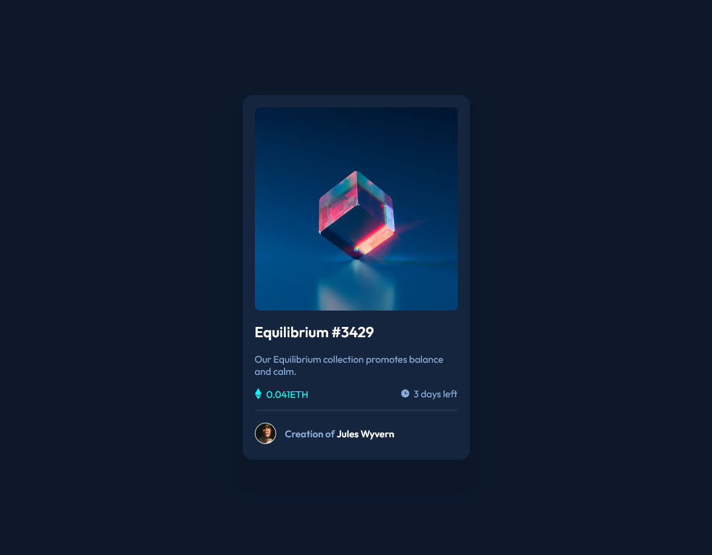

# Frontend Mentor - NFT preview card component

## Sobre o desafio 👋 PT - BR

Criar esse componente em estilo de carta e fazer com que se pareça ao máximo com o design proposto.

Os usuários devem ser capaz de :

- Ver o layout ideal dependendo da tela do dispositivo.
- Ver os efeitos de hover pra elementos interativos.

## About the challenge 👋 EN - US

Create this card component and make it look as close as possible to the proposed design.

Users must be able to:

- See the optimal layout depending on your device screen.
- View hover effects for interactive elements.

## To see more challenges, go to :
https://www.frontendmentor.io
